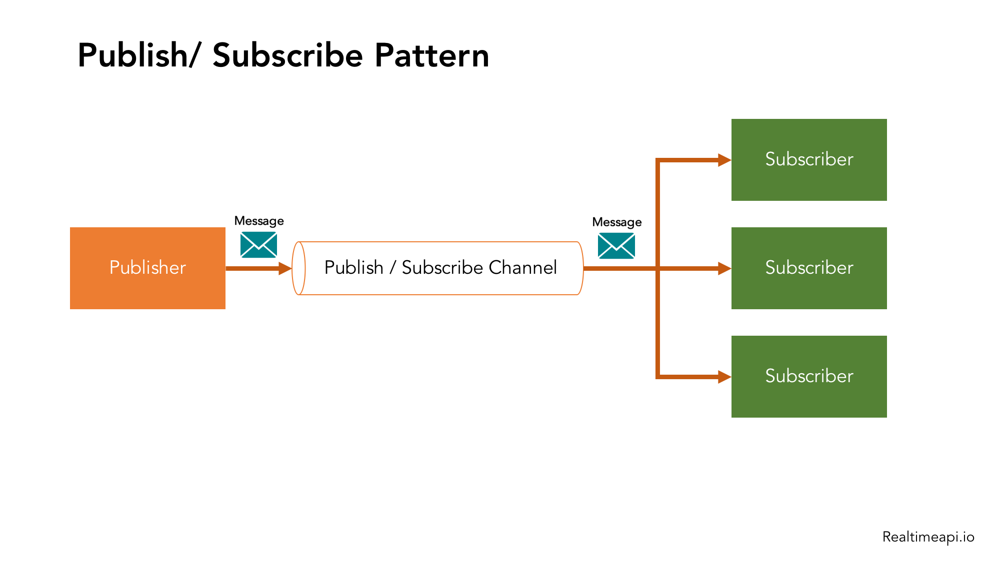

# Design and Implementation

## Agenda

* Objectives
* Object-oriented design using the UML
* Design patterns
* Implementation issues
* Open source development

## Objectives

The objectives of this chapter are to introduce object-oriented software
design using the UML and highlight important implementation concerns.

* understand the most important activities in a general, objectoriented design process;
* understand some of the different models that may be used to
document an object-oriented design;
* know about the idea of design patterns and how these are a way
of reusing design knowledge and experience;
* have been introduced to key issues that have to be considered when implementing software, including software reuse and open-source development.

Design and implementation are closely linked and you should normally take implementation issues into account when developing a design.

One of the most important implementation decisions that has to be made at an
early stage of a software project is whether or not you should buy or build the application software. In a wide range of domains, it is now possible to buy off-the-shelf systems (COTS) that can be adapted and tailored to the users’ requirements.When you develop an application in this way, the design process becomes concerned with how to use the configuration features of that system to deliver the system requirements [Chapter 16]

### This chapter has two aims:

1. To show how system modeling and architectural design (covered in Chapters 5
and 6) are put into practice in developing an object-oriented software design.

2. To introduce important implementation issues that are not usually covered in
programming books. These include software reuse, configuration management,
and open source development.

## Object-oriented design using the UML

To develop a system design from concept to detailed, object-oriented design,
there are several things that you need to do:

1. Understand and define the context and the external interactions with the system.
2. Design the system architecture.
3. Identify the principal objects in the system.
4. Develop design models.
5. Specify interfaces.

7.1.1 System context and interactions

The first stage in any software design process is to develop an understanding of the relationships between the software that is being designed and its external environment. This is essential for deciding how to provide the required system functionality and how to structure the system to communicate with its environment. Understanding of the context also lets you establish the boundaries of the system.
Setting the system boundaries helps you decide what features are implemented
in the system being designed and what features are in other associated systems.

System context models and interaction models present complementary views of
the relationships between a system and its environment:

1. A system context model is a structural model that demonstrates the other systems in the environment of the system being developed.
2. An interaction model is a dynamic model that shows how the system interacts with its environment as it is used.

The context model of a system may be represented using associations. Associations
simply show that there are some relationships between the entities involved in the
association. The nature of the relationships is now specified. You may therefore document the environment of the system using a simple block diagram, showing the entities
in the system and their associations.

the systems in the environment of each weather station are a weather information system, an onboard satellite system, and a control system. The cardinality information on
the link shows that there is one control system but several weather stations, one satellite,
and one general weather information system.
When you model the interactions of a system with its environment you should use
an abstract approach that does not include too much detail.
Each possible interaction is named in an ellipse and the
external entity involved in the interaction is represented by a stick figure.

 a stick figure is used in the UML to represent other systems
as well as human users.

Each of these use cases should be described in structured natural language. This
helps designers identify objects in the system and gives them an understanding of
what the system is intended to do. I use a standard format for this description that
clearly identifies what information is exchanged, how the interaction is initiated, and so on.

You identify the major components that make up the system and their interactions,
and then may organize the components using an architectural pattern such as a layered or client–server model. However, this is not essential at this stage.
The high-level architectural design for the weather station software is shown in
Figure 7.4. The weather station is composed of independent subsystems that communicate by broadcasting messages on a common infrastructure, shown as the
Communication link in Figure 7.4. Each subsystem listens for messages on that
infrastructure and picks up the messages that are intended for them. This is
another commonly used architectural style in addition to those described in
Chapter 6.
For example, when the communications subsystem receives a control command, such as shutdown, the command is picked up by each of the other subsystems, which then shut themselves down in the correct way. The key benefit of this
architecture is that it is easy to support different configurations of subsystems
because the sender of a message does not need to address the message to a particular subsystem.

7.1.2 Architectural design

The use case description helps to identify objects and operations in the system. From the description of the Report weather use case, it is obvious that objects representing the instruments that collect weather data will be required, as will an object representing the summary of the weather data.
You also usually need a high-level system object or objects that encapsulate the system interactions defined in the use cases. With these objects in mind, you can start to identify the object classes in the system.

In practice, you have to use several knowledge sources to discover object classes.
Object classes, attributes, and operations that are initially identified from the informal system description can be a starting point for the design. Further information
from application domain knowledge or scenario analysis may then be used to refine
and extend the initial objects. This information can be collected from requirements
documents, discussions with users, or from analyses of existing systems.

The Ground thermometer,
Anemometer, and Barometer objects are application domain objects, and the
WeatherStation and WeatherData objects have been identified from the system
description and the scenario (use case) description:...

You use knowledge of the application domain to identify other objects, attributes, and services. We know that weather stations are often located in remote places and include various instruments that sometimes go wrong. Instrument failures should be reported automatically. This implies that you need attributes and operations to check the correct functioning of the instruments

7.1.4 Design models
Design or system models, as I discussed in Chapter 5, show the objects or object classes in a system. They also show the associations and relationships between these entities.
These models are the bridge between the system requirements and the implementation of a system. They have to be abstract so that unnecessary detail doesn’t hide the relationships between them and the system requirements. However, they also have to include enough detail for programmers to make implementation decisions.

Generally, you get around this type of conflict by developing models at different
levels of detail. Where there are close links between requirements engineers, designers, and programmers, then abstract models may be all that are required. Specific design decisions may be made as the system is implemented, with problems resolved through informal discussions. When the links between system specifiers, designers, and programmers are indirect (e.g., where a system is being designed in one part of an organization but implemented elsewhere), then more detailed models are likely to be needed.

The UML supports 13 different types of models but, as I
discussed in Chapter 5, you rarely use all of these. Minimizing the number of models that are produced reduces the costs of the design and the time required to complete the design process.
When you use the UML to develop a design, you will normally develop two kinds
of design model:

1. Structural models, which describe the static structure of the system using object
classes and their relationships. Important relationships that may be documented
at this stage are generalization (inheritance) relationships, uses/used-by relationships, and composition relationships.
2. Dynamic models, which describe the dynamic structure of the system and show
the interactions between the system objects. Interactions that may be documented include the sequence of service requests made by objects and the state
changes that are triggered by these object interactions.
In the early stages of the design process, I think there are three models that are
particularly useful for adding detail to use case and architectural models:

1. Subsystem models, which that show logical groupings of objects into coherent
subsystems. These are represented using a form of class diagram with each subsystem shown as a package with enclosed objects. Subsystem models are static
(structural) models.
2. Sequence models, which show the sequence of object interactions. These are
represented using a UML sequence or a collaboration diagram. Sequence
models are dynamic models.
3. State machine model, which show how individual objects change their state in
response to events. These are represented in the UML using state diagrams.
State machine models are dynamic models.

A subsystem model is a useful static model as it shows how a design is organized into
logically related groups of objects.  There is
a danger in doing too much modeling. You should not make detailed decisions about the
implementation that really should be left to the system programmers

Sequence models are dynamic models that describe, for each mode of interaction,
the sequence of object interactions that take place. When documenting a design, you
should produce a sequence model for each significant interaction. If you have developed a use case model then there should be a sequence model for each use case that
you have identified.

Figure 7.7 is an example of a sequence model, shown as a UML sequence diagram. This diagram shows the sequence of interactions that take place when an
external system requests the summarized data from the weather station.

Sequence diagrams are used to model the combined behavior of a group of
objects but you may also want to summarize the behavior of an object or a subsystem
in response to messages and events. To do this, you can use a state machine model
that shows how the object instance changes state depending on the messages that it
receives. The UML includes state diagrams, initially invented by Harel (1987) to
describe state machine models.

State diagrams are useful high-level models of a system or an object’s operation.
You don’t usually need a state diagram for all of the objects in the system. Many of the objects in a system are relatively simple and a state model adds unnecessary detail to the design.

7.1.5 Interface specification

An important part of any design process is the specification of the interfaces between
the components in the design. You need to specify interfaces so that objects and subsystems can be designed in parallel. Once an interface has been specified, the developers of other objects may assume that interface will be implemented.
Interface design is concerned with specifying the detail of the interface to an
object or to a group of objects. This means defining the signatures and semantics of
the services that are provided by the object or by a group of objects. Interfaces can be
specified in the UML using the same notation as a class diagram.

You should not include details of the data representation in an interface design,
as attributes are not defined in an interface specification. However, you should
include operations to access and update data. As the data representation is hidden, it
can be easily changed without affecting the objects that use that data. This leads to
a design that is inherently more maintainable.

7.2 Design patterns

Design patterns were derived from ideas put forward by Christopher Alexander
(Alexander et al., 1977), who suggested that there were certain common patterns of
building design that were inherently pleasing and effective. The pattern is a description
of the problem and the essence of its solution, so that the solution may be reused in different settings. The pattern is not a detailed specification. Rather, you can think of it
as a description of accumulated wisdom and experience, a well-tried solution to a common problem.
A quote from the Hillside Group web site (http://hillside.net), which is dedicated
to maintaining information about patterns, encapsulates their role in reuse:
Patterns and Pattern Languages are ways to describe best practices, good
designs, and capture experience in a way that it is possible for others to reuse
this experience.
Patterns have made a huge impact on object-oriented software design. As well as
being tested solutions to common problems, they have become a vocabulary for talking about a design. You can therefore explain your design by describing the patterns
that you have used.

https://realtimeapi.io/hub/publishsubscribe-pattern/

Design patterns are usually associated with object-oriented design. Published patterns often rely on object characteristics such as inheritance and polymorphism to provide generality. However, the general principle of encapsulating experience.

 Patterns are a way of reusing the
knowledge and experience of other designers.
The four essential elements of design patterns were defined by the ‘Gang of Four’ in their patterns book:
1. A name that is a meaningful reference to the pattern.
2. A description of the problem area that explains when the pattern may be applied.
3. A solution description of the parts of the design solution, their relationships, and
their responsibilities. This is not a concrete design description. It is a template
for a design solution that can be instantiated in different ways. This is often expressed graphically and shows the relationships between the objects and object classes in the solution.
4. A statement of the consequences—the results and trade-offs—of applying the pattern. This can help designers understand whether or not a pattern can be used in a particular situation.

Patterns support high-level, concept reuse. When you try to reuse executable
components you are inevitably constrained by detailed design decisions that have
been made by the implementers of these components. These range from the
particular algorithms that have been used to implement the components to the
objects and types in the component interfaces. When these design decisions conflict with your particular requirements, reusing the component is either impossible or introduces inefficiencies into your system. Using patterns means that you reuse the ideas but can adapt the implementation to suit the system that
you are developing.
When you start designing a system, it can be difficult to know, in advance, if you
will need a particular pattern. Therefore, using patterns in a design process often
involves developing a design, experiencing a problem, and then recognizing that a
pattern can be used.

Patterns are a great idea but you need experience of software design to use them
effectively. You have to recognize situations where a pattern can be applied.
Inexperienced programmers, even if they have read the pattern books, will always
find it hard to decide whether they can reuse a pattern or need to develop a specialpurpose solution.

7.3 Implementation issues

Software engineering includes all of the activities involved in software development
from the initial requirements of the system through to maintenance and management of the deployed system. A critical stage of this process is, of course, system
implementation, where you create an executable version of the software.
Implementation may involve developing programs in high- or low-level programming
languages or tailoring and adapting generic, off-the-shelf systems to meet the specific requirements of an organization.

* I introduce some aspects of implementation that are particularly important to software engineering that are often not covered in programming texts. These are:

1. Reuse Most modern software is constructed by reusing existing components or
systems. When you are developing software, you should make as much use as
possible of existing code.
2. Configuration management During the development process, many different
versions of each software component are created. If you don’t keep track of
these versions in a configuration management system, you are liable to include
the wrong versions of these components in your system.
3. Host-target development Production software does not usually execute on the
same computer as the software development environment. Rather, you develop
it on one computer (the host system) and execute it on a separate computer (the
target system). The host and target systems are sometimes of the same type but,
often they are completely different.

Software reuse is possible at a number of different levels:
1. The abstraction level At this level, you don’t reuse software directly but rather
use knowledge of successful abstractions in the design of your software. Design
patterns and architectural patterns (covered in Chapter 6) are ways of representing abstract knowledge for reuse.
2. The object level At this level, you directly reuse objects from a library rather
than writing the code yourself. To implement this type of reuse, you have to find
appropriate libraries and discover if the objects and methods offer the functionality that you need. For example, if you need to process mail messages in a Java
program, you may use objects and methods from a JavaMail library.
3. The component level Components are collections of objects and object classes
that operate together to provide related functions and services. You often have to
adapt and extend the component by adding some code of your own. An example
of component-level reuse is where you build your user interface using a framework. This is a set of general object classes that implement event handling, display management, etc. You add connections to the data to be displayed and
write code to define specific display details such as screen layout and colors.
4. The system level At this level, you reuse entire application systems. This usually
involves some kind of configuration of these systems. This may be done by
adding and modifying code (if you are reusing a software product line) or by
using the system’s own configuration interface. Most commercial systems are
now built in this way where generic COTS (commercial off-the-shelf) systems
are adapted and reused. Sometimes this approach may involve reusing several
different systems and integrating these to create a new system.

By reusing existing software, you can develop new systems more quickly, with
fewer development risks and also lower costs. As the reused software has been tested
in other applications, it should be more reliable than new software. However, there
are costs associated with reuse:
1. The costs of the time spent in looking for software to reuse and assessing
whether or not it meets your needs. You may have to test the software to make
sure that it will work in your environment, especially if this is different from its
development environment.
2. Where applicable, the costs of buying the reusable software. For large off-theshelf systems, these costs can be very high.

3. The costs of adapting and configuring the reusable software components or systems to reflect the requirements of the system that you are developing.
4. The costs of integrating reusable software elements with each other (if you are
using software from different sources) and with the new code that you have
developed. Integrating reusable software from different providers can be difficult and expensive because the providers may make conflicting assumptions
about how their respective software will be reused.
How to reuse existing knowledge and software should be the first thing you should
think about when starting a software development project. You should consider the
possibilities of reuse before designing the software in detail, as you may wish to adapt
your design to reuse existing software assets.

7.3.2 Configuration management
In software development, change happens all the time, so change management is
absolutely essential. When a team of people are developing software, you have to
make sure that team members don’t interfere with each others’ work. That is, if two
people are working on a component, their changes have to be coordinated. Otherwise,
one programmer may make changes and overwrite the other’s work. 

Configuration management is the name given to the general process of managing
a changing software system. The aim of configuration management is to support the
system integration process so that all developers can access the project code and documents in a controlled way, find out what changes have been made, and compile and
link components to create a system. There are, therefore, three fundamental configuration management activities:

1. Version management, where support is provided to keep track of the different
versions of software components. Version management systems include facilities to coordinate development by several programmers. They stop one developer overwriting code that has been submitted to the system by someone else.
2. System integration, where support is provided to help developers define what
versions of components are used to create each version of a system. This
description is then used to build a system automatically by compiling and linking the required components.
3. Problem tracking, where support is provided to allow users to report bugs and
other problems, and to allow all developers to see who is working on these problems and when they are fixed.

7.3.3 Host-target development
Most software development is based on a host-target model. Software is developed on
one computer (the host), but runs on a separate machine (the target). More generally,
we can talk about a development platform and an execution platform. A platform is
more than just hardware. It includes the installed operating system plus other supporting software such as a database management system or, for development platforms,
an interactive development environment.

Simulators are often used when developing embedded systems. You simulate hardware devices, such as sensors, and the events in the environment in which the system
will be deployed. Simulators speed up the development process for embedded systems
as each developer can have their own execution platform with no need to download the
software to the target hardware. However, simulators are expensive to develop and so
are only usually available for the most popular hardware architectures.
If the target system has installed middleware or other software that you need to
use, then you need to be able to test the system using that software. It may be impractical to install that software on your development machine, even if it is the same as
the target platform, because of license restrictions. In those circumstances, you need
to transfer your developed code to the execution platform to test the system

A software development platform should provide a range of tools to support software engineering processes. These may include:
1. An integrated compiler and syntax-directed editing system that allows you to
create, edit, and compile code.
2. A language debugging system.
3. Graphical editing tools, such as tools to edit UML models.
4. Testing tools, such as JUnit (Massol, 2003) that can automatically run a set of
tests on a new version of a program.
5. Project support tools that help you organize the code for different development
projects.

7.4 Open source development

Open source development is an approach to software development in which the
source code of a software system is published and volunteers are invited to participate in the development process (Raymond, 2001). Its roots are in the Free Software
Foundation (http://www.fsf.org), which advocates that source code should not be
proprietary but rather should always be available for users to examine and modify as
they wish. There was an assumption that the code would be controlled and developed by a small core group, rather than users of the code.

 best-known open source product is, of course, the Linux operating system

However, if you want documentation and support, then you may have to pay for this, but costs are usually fairly
low. The other key benefit of using open source products is that mature open source
systems are usually very reliable. The reason for this is that they have a large population of users who are willing to fix problems themselves r

For a company involved in software development, there are two open source
issues that have to be considered:
1. Should the product that is being developed make use of open source components?
2. Should an open source approach be used for the software’s development?

The answers to these questions depend on the type of software that is being developed and the background and experience of the development team. 
If you are developing a software product for sale, then time to market and reduced
costs are critical. If you are developing in a domain in which there are high-quality
open source systems available, you can save time and money by using these systems.
However, if you are developing software to a specific set of organizational requirements, then using open source components may not be an option. 

7.4.1 Open source licensing

Most open source licenses are derived from one of three general models:
1. The GNU General Public License (GPL). This is a so-called ‘reciprocal’ license
that, simplistically, means that if you use open source software that is licensed
under the GPL license, then you must make that software open source.
2. The GNU Lesser General Public License (LGPL). This is a variant of the GPL
license where you can write components that link to open source code without
having to publish the source of these components. However, if you change the
licensed component, then you must publish this as open source.
3. The Berkley Standard Distribution (BSD) License. This is a non-reciprocal
license, which means you are not obliged to republish any changes or modifications made to open source code. You can include the code in proprietary systems
that are sold. If you use open source components, you must acknowledge the
original creator of the code.
Licensing issues are important because if you use open-source software as part of
a software product, then you may be obliged by the terms of the license to make your
own product open source. If you are trying to sell your software, you may wish to
keep it secret. This means that you may wish to avoid using GPL-licensed open
source software in its development.

If you are building software that runs on an open source platform, such as Linux,
then licenses are not a problem. However, as soon as you start including open source
components in your software you need to set up processes and databases to keep
track of what’s been used and their license conditions. Bayersdorfer (2007) suggests
that companies managing projects that use open source should:
1. Establish a system for maintaining information about open source components
that are downloaded and used. You have to keep a copy of the license for each

component that was valid at the time the component was used. Licenses may
change so you need to know the conditions that you have agreed to.
2. Be aware of the different types of licenses and understand how a component is
licensed before it is used. You may decide to use a component in one system but
not in another because you plan to use these systems in different ways.
3. Be aware of evolution pathways for components. You need to know a bit about
the open source project where components are developed to understand how
they might change in future.
4. Educate people about open source. It’s not enough to have procedures in place
to ensure compliance with license conditions. You also need to educate developers about open source and open source licensing.
5. Have auditing systems in place. Developers, under tight deadlines, might be
tempted to break the terms of a license. If possible, you should have software in
place to detect and stop this.
6. Participate in the open source community. If you rely on open source products,
you should participate in the community and help support their development.

## K E Y P O I N T S

* Software design and implementation are interleaved activities. The level of detail in the design
depends on the type of system being developed and whether you are using a plan-driven or
agile approach.
* The process of object-oriented design includes activities to design the system architecture,
identify objects in the system, describe the design using different object models, and document
the component interfaces.
* A range of different models may be produced during an object-oriented design process. These
include static models (class models, generalization models, association models) and dynamic
models (sequence models, state machine models).
* Component interfaces must be defined precisely so that other objects can use them. A UML
interface stereotype may be used to define interfaces.
* When developing software, you should always consider the possibility of reusing existing
software, either as components, services, or complete systems.
* Configuration management is the process of managing changes to an evolving software system.
It is essential when a team of people are cooperating to develop software.
* Most software development is host-target development. You use an IDE on a host machine to
develop the software, which is transferred to a target machine for execution.
* Open source development involves making the source code of a system publicly available. This
means that many people can propose changes and improvements to the software.
